# DIAGRAMMES UML COMPLETS — Système de Gestion Intelligente des Congés

## 1. DIAGRAMME DE CAS D'UTILISATION

Le diagramme de cas d'utilisation représente les interactions entre les acteurs (Employé, Responsable RH / Super Admin) et le système. Le système externe **Dolibarr** et le **système de notification e-mail** apparaissent comme acteurs secondaires.

Conventions : **généralisation** (un cas parent décliné en cas enfants), **«include»** pour un comportement toujours exécuté (authentification, calcul des jours), **«extend»** pour un comportement optionnel.

### 1.1. Vue globale

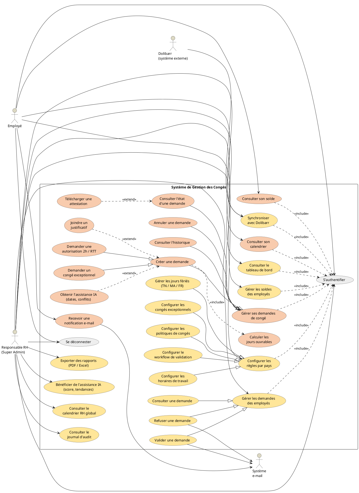

Pour plus de lisibilité, ce diagramme global est ensuite détaillé **par acteur** (package Employé, package Responsable RH).

### 1.2. Package Employé

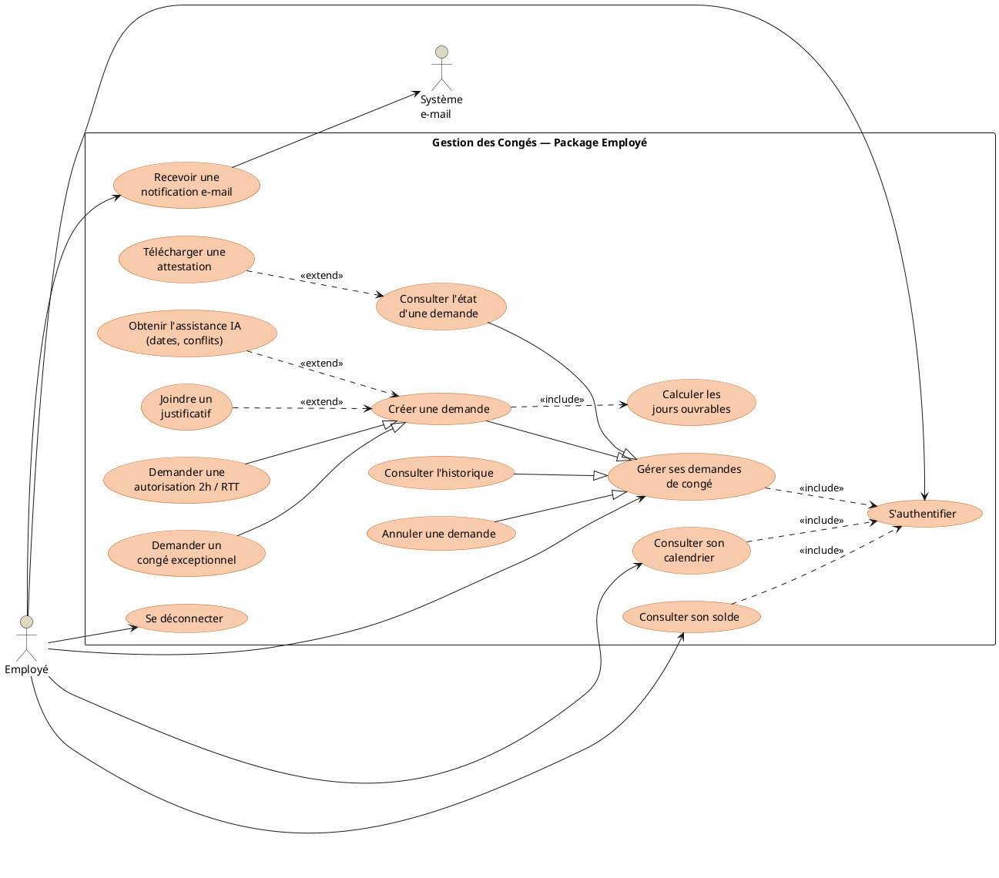

### 1.3. Package Responsable RH (Super Admin)

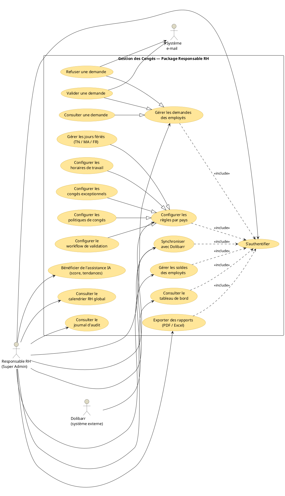

---

## 2. DIAGRAMME DE CLASSE (MODÈLE DE DONNÉES)

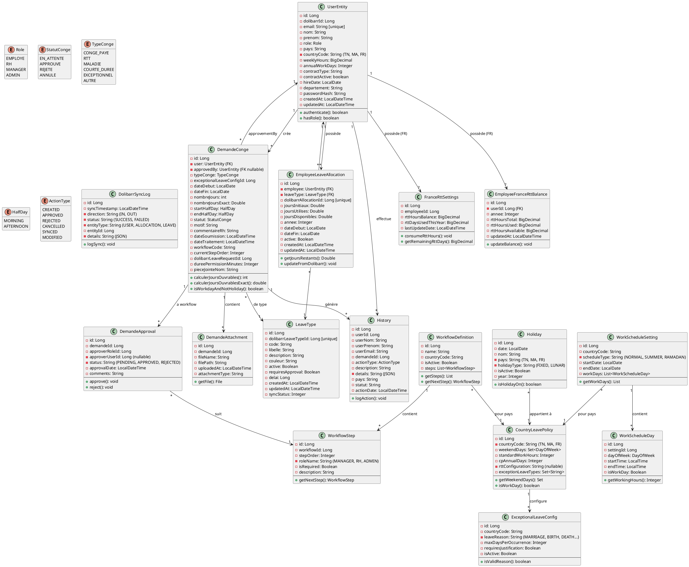

---

## 3. DIAGRAMME DE SÉQUENCE — Créer une Demande de Congé

```plantuml
@startuml Sequence_CreateRequest
actor "Employé" as Emp
participant "Frontend React" as FE
participant "API Demande\nController" as API
participant "CongeService" as Service
participant "LeaveCalculation\nService" as CalcSvc
participant "Repository" as Repo
database "MySQL DB" as DB

Emp -> FE: Remplir formulaire\n(type, dates, motif)
FE -> FE: Validation locale\n(dates, format)

FE -> API: POST /api/demandes\n{typeConge, dateDebut, dateFin, motif}\n+ JWT token
activate API
API -> API: Vérifier JWT + RBAC\n(EMPLOYE)

API -> Service: creerDemande(\nemployeeId, request)
activate Service

Service -> CalcSvc: calculerJoursOuvrables(\ndateDebut, dateFin, \ncountryCode)
activate CalcSvc
CalcSvc -> Repo: getActiveHolidays(\ncountryCode)
Repo -> DB: SELECT * FROM holiday\nWHERE pays = countryCode\nAND isActive = 1
DB --> Repo: List<Holiday>
CalcSvc -> CalcSvc: Exclure weekends\n+ jours fériés\n+ demi-journées
CalcSvc --> Service: nombreJoursExact\n= 5.5 jours
deactivate CalcSvc

Service -> Repo: getEmployeeBalance(\nemployeeId, typeConge)
Repo -> DB: SELECT * FROM employee_leave_allocations\nWHERE userId = employeeId\nAND leaveTypeId = typeConge
DB --> Repo: EmployeeLeaveAllocation
Service -> Service: Vérifier solde\nsuffisant ?
alt Solde insuffisant
    Service --> API: CongesInsufficientException
    API --> FE: 400 Bad Request\n"Solde insuffisant"
    FE -> FE: Afficher erreur
    FE -> Emp: Message erreur
    stop
end

Service -> Repo: saveDemande(\nnew DemandeConge)
activate Repo
Repo -> DB: INSERT INTO demandes_conge\n(user_id, type_conge,\ndate_debut, date_fin,\nnombre_jours_exact, statut, motif)\nVALUES (...)
DB --> Repo: ID demande créée
deactivate Repo

Service -> Repo: saveHistory(\nActionType.CREATED)
Repo -> DB: INSERT INTO history\n(user_id, demande_id, action_type,\naction_date, details)
DB --> Repo: OK

Service --> API: DemandeCongeResponse\n{id, statut=EN_ATTENTE, ...}
deactivate Service

API --> FE: 201 Created\n{demande}
deactivate API

FE -> FE: Afficher confirmation\n+ numéro demande

FE -> Emp: "Demande créée !\nN° demande: #123456"

@enduml
```

---

## 4. DIAGRAMME DE SÉQUENCE — Valider une Demande (RH avec Règles Multi-Pays)

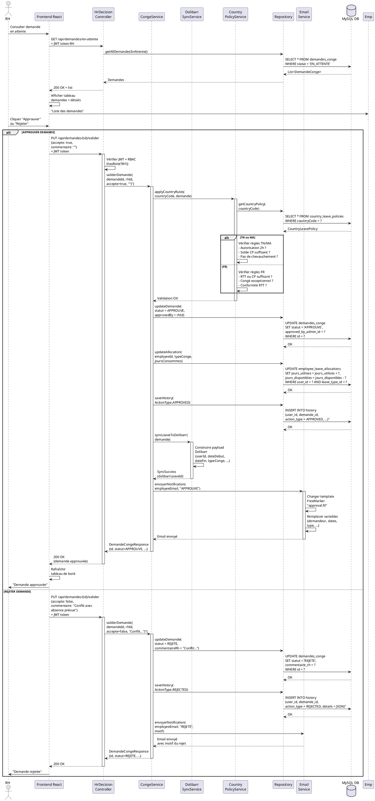

---

## 5. DIAGRAMME DE SÉQUENCE — Authentification Dolibarr (Login)

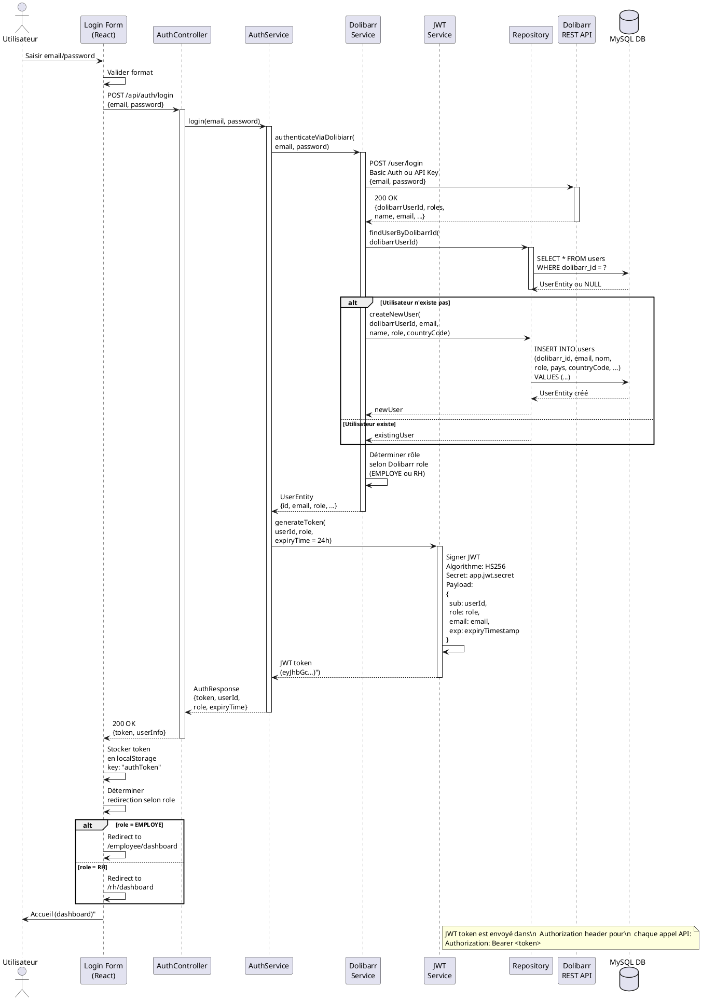

---

## 6. DIAGRAMME DE DÉPLOIEMENT

```plantuml
@startuml DeploymentDiagram
!define BACKEND_COLOR #87CEEB
!define FRONTEND_COLOR #98FB98
!define DATABASE_COLOR #FFB6C1
!define EXTERNAL_COLOR #DEB887

node "Client Browser" as ClientNode <<device>> #FRONTEND_COLOR {
    artifact "React SPA\n(Vite Build)" as ReactApp
    artifact "State Management\n(Context API)" as StateMan
    artifact "Axios HTTP Client" as HttpClient
    artifact "Tailwind CSS Styling" as TailwindCSS
}

node "Application Server\n(Spring Boot - AWS/On-Premises)" as AppServer <<node>> #BACKEND_COLOR {
    artifact "Embedded Tomcat\n(Port 8080)" as Tomcat
    artifact "Spring Web MVC\nControllers" as Controllers
    artifact "Security Layer\n(JWT Filter)" as Security
    artifact "Business Logic\nServices" as Services
    artifact "Data Access\nRepositories (JPA)" as Repositories
    artifact "Integration\nServices" as IntegrationSvc
    artifact "Email Service\n(FreeMarker + SMTP)" as EmailSvc
    artifact "File Storage\nService" as FileSvc
}

node "Database Server\n(MariaDB/MySQL)" as DBServer <<database>> #DATABASE_COLOR {
    database "Leave Management\nDatabase" as AppDB {
        component "users" as TableUsers
        component "demandes_conge" as TableDemandes
        component "employee_leave_allocations" as TableAllocations
        component "leave_types" as TableLeaveTypes
        component "holidays" as TableHolidays
        component "history" as TableHistory
        component "workflow_definitions" as TableWorkflows
        component "country_leave_policies" as TablePolicies
        component "work_schedule_settings" as TableSchedules
    }
}

node "Dolibarr Server\n(External ERP)" as DolibarrServer <<device>> #EXTERNAL_COLOR {
    artifact "Dolibarr REST API\n(/user, /hrm/...)" as DoliAPI
    artifact "Authentication\n(API Key or OAuth)" as DoliAuth
}

node "Email Server" as EmailServer <<device>> #EXTERNAL_COLOR {
    artifact "SMTP Server\n(localhost:25 or\nexternal provider)" as SMTP
}

node "File Storage" as FileStorage <<device>> #EXTERNAL_COLOR {
    artifact "Local Filesystem\n(/uploads/attachments)" as LocalFS
}

' Relationships
ClientNode --|> AppServer : HTTPS\n(JWT in header)
AppServer --|> DBServer : JDBC/Hibernate\n(SQL)
AppServer --|> DolibarrServer : HTTPS REST\n(API Key auth)
AppServer --|> EmailServer : SMTP\n(outbound mail)
AppServer --|> FileStorage : File I/O\n(upload/download)

ReactApp --|> StateMan
ReactApp --|> HttpClient
ReactApp --|> TailwindCSS

HttpClient --|> Controllers : Axios calls

Tomcat --|> Controllers
Controllers --|> Security
Security --|> Controllers

Controllers --|> Services
Services --|> Repositories
Services --|> IntegrationSvc
Services --|> EmailSvc
Services --|> FileSvc

Repositories --|> AppDB
EmailSvc --|> SMTP
FileSvc --|> LocalFS
IntegrationSvc --|> DoliAPI

@enduml
```

---

## 7. DIAGRAMME D'ACTIVITÉ — Workflow Demande de Congé

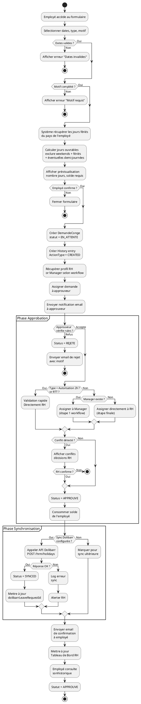

---

## 8. DIAGRAMME DE COMPOSANTS (ARCHITECTURE COUCHES)

```plantuml
@startuml ComponentDiagram
!define PRESENTATION #FFE4C4
!define API #87CEEB
!define SERVICE #90EE90
!define REPOSITORY #FFB6C1
!define DB #DEB887
!define EXTERNAL #D3D3D3

package "Frontend Layer (React + Vite)" <<folder>> #PRESENTATION {
    component "Pages" as Pages {
        [LoginPage]
        [EmployeeDashboard]
        [CreateRequestForm]
        [LeaveHistory]
        [RhDashboard]
        [ConfigurationPages]
        [CalendarView]
    }
    
    component "Components" as Components {
        [FormFields]
        [Tables]
        [Cards]
        [Modals]
        [Notifications]
    }
    
    component "Services" as FEServices {
        [API Service (Axios)]
        [Auth Service]
        [Local Storage Service]
    }
    
    component "State Management" as StateMan {
        [Context API]
        [Custom Hooks]
        [useAuth]
        [useLeaveData]
    }
}

package "API Layer (Spring Boot Controllers)" <<folder>> #API {
    component "REST Controllers" as Controllers {
        [AuthController]
        [DemandeController]
        [EmployeeController]
        [RhDashboardController]
        [HrConfigController]
        [DolibarrSyncController]
        [ReportController]
        [CalendarController]
    }
    
    component "Security & CORS" as APISecurity {
        [JWT Filter]
        [CORS Configuration]
        [Exception Handler]
    }
    
    component "Request/Response" as RequestResponse {
        [DTOs (Request/Response)]
        [Validation Annotations]
        [Error Responses]
    }
}

package "Business Logic Layer (Services)" <<folder>> #SERVICE {
    component "Core Services" as CoreServices {
        [AuthenticationService]
        [CongeService]
        [EmployeeLeaveService]
        [LeaveCalculationService]
        [WorkflowService]
    }
    
    component "Configuration Services" as ConfigServices {
        [CountryPolicyService]
        [HolidayService]
        [ScheduleService]
        [ExceptionalLeaveService]
    }
    
    component "Integration Services" as IntegServices {
        [DolibarrSyncService]
        [DolibarrAuthService]
    }
    
    component "Supporting Services" as SupportServices {
        [EmailNotificationService]
        [ReportGenerationService]
        [FileStorageService]
        [HistoryAuditService]
    }
}

package "Data Access Layer (Repositories)" <<folder>> #REPOSITORY {
    component "JPA Repositories" as JpaRepos {
        [UserRepository]
        [DemandeCongeRepository]
        [EmployeeLeaveAllocationRepository]
        [LeaveTypeRepository]
        [HolidayRepository]
        [HistoryRepository]
        [WorkflowRepository]
    }
    
    component "ORM Mapping" as ORM {
        [Hibernate ORM]
        [Entity Mapping]
        [Lazy Loading Config]
    }
}

package "Infrastructure Layer" <<folder>> #DB {
    component "Databases" as Databases {
        [MySQL/MariaDB]
        [Connection Pool (HikariCP)]
    }
    
    component "External Services" as ExternalSvc {
        [Dolibarr REST API]
        [SMTP Mail Server]
        [File System (Attachments)]
    }
}

package "Cross-Cutting Concerns" <<folder>> #EXTERNAL {
    component "Logging & Monitoring" as LogMon {
        [SLF4J Logging]
        [Audit Trail]
        [Performance Metrics]
    }
    
    component "Configuration" as Config {
        [application.yml]
        [JWT Secret]
        [Dolibarr API Key]
        [Country Rules Config]
    }
}

' Relationships
Pages --> Components
Components --> StateMan
Pages --> StateMan
StateMan --> FEServices
FEServices --|> Controllers : HTTP/HTTPS

Controllers --|> APISecurity
Controllers --> RequestResponse
Controllers --> CoreServices
Controllers --> ConfigServices
Controllers --> IntegServices
Controllers --> SupportServices

CoreServices --> ConfigServices
CoreServices --> JpaRepos
CoreServices --> IntegServices
CoreServices --> SupportServices

ConfigServices --> JpaRepos
IntegServices --> ExternalSvc

SupportServices --> JpaRepos
SupportServices --> Databases
SupportServices --> ExternalSvc

JpaRepos --> ORM
ORM --> Databases

CoreServices -.-> LogMon
APISecurity -.-> LogMon

IntegServices -.-> Config

@enduml
```

---

## 9. DIAGRAMME DE CAS D'UTILISATION PAR SPRINT

### Sprint 1 — Authentification, Sécurité & Socle

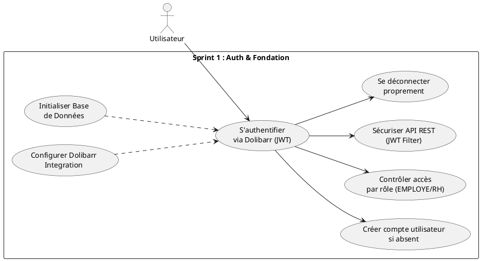

### Sprint 2 — Demandes Côté Employé

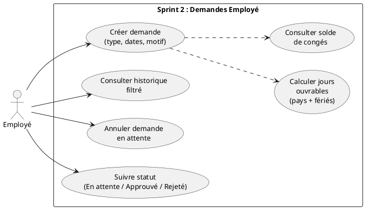

### Sprint 3 — Validation RH & Workflow BPM

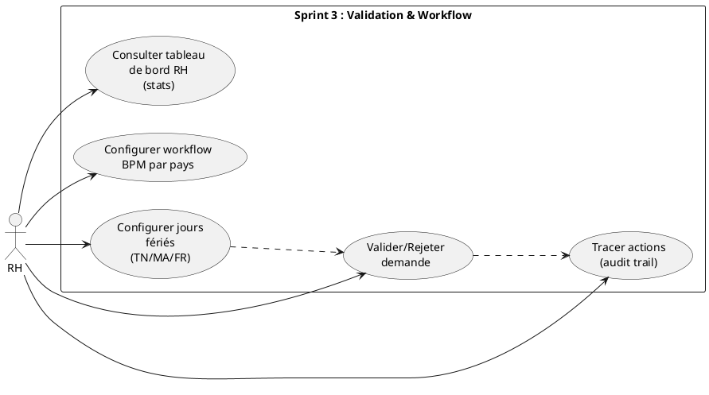

### Sprint 4 — Intégration Dolibarr & Config RH

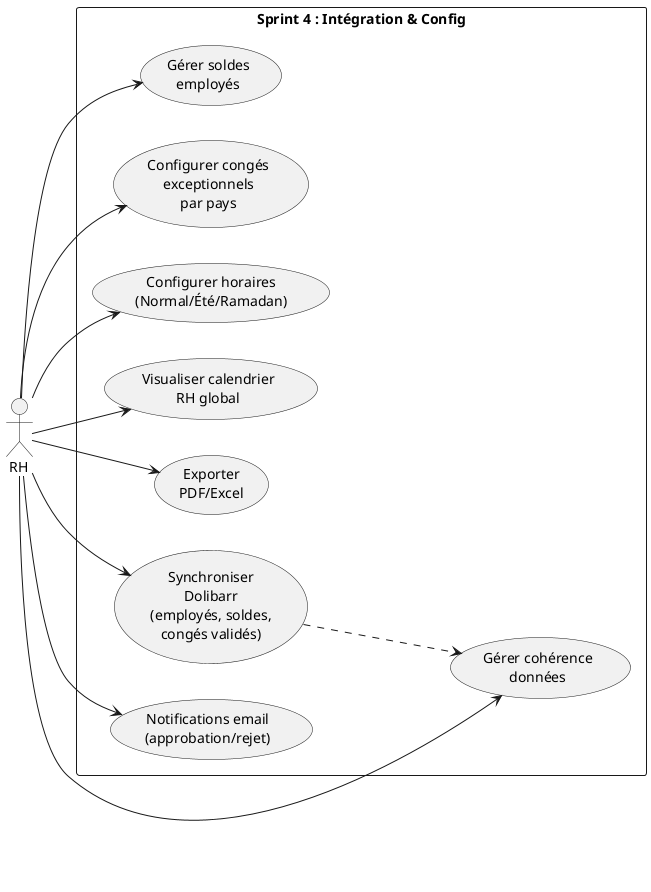

### Sprint 5 — IA & Finalisation

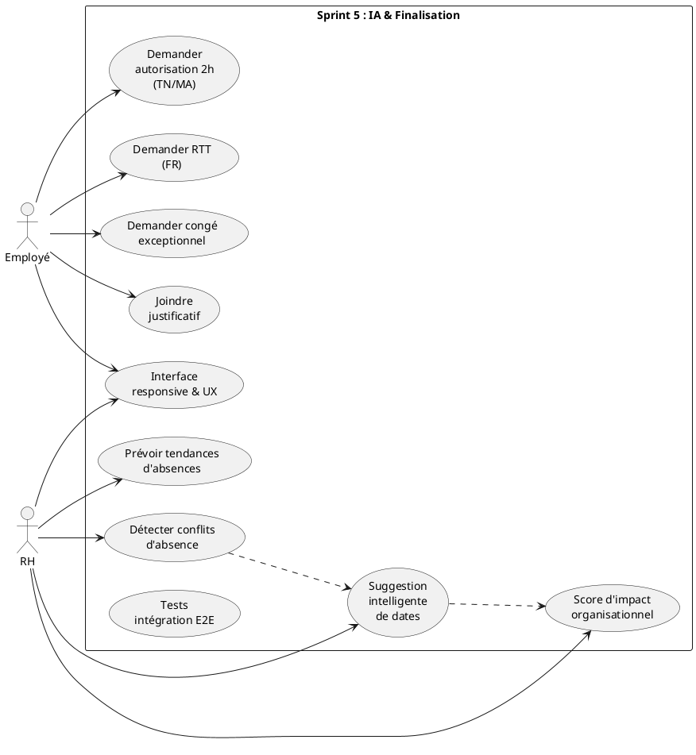

---

## 10. TABLEAU RÉCAPITULATIF DES DIAGRAMMES

| ID | Diagramme | Type | Éléments | Fichier PlantUML |
|----|-----------|------|----------|------------------|
| 1 | Cas d'utilisation — Vue globale | Use Case | 2 acteurs + Dolibarr + Système e-mail · généralisation + «include»/«extend» | UC_Global |
| 1a | Cas d'utilisation — Package Employé | Use Case | Employé + Système e-mail · généralisation + «include»/«extend» | UC_Package_Employe |
| 1b | Cas d'utilisation — Package RH | Use Case | RH + Dolibarr + Système e-mail · généralisation + «include»/«extend» | UC_Package_RH |
| 2 | Modèle de données | Class | 15+ entités + énums + relations | ClassDiagram |
| 3 | Créer demande de congé | Sequence | 6 participants + calcul jours | Sequence_CreateRequest |
| 4 | Valider demande (multi-pays) | Sequence | 7 participants + règles pays | Sequence_ValidateRequest |
| 5 | Authentification Dolibarr | Sequence | 6 participants + JWT | Sequence_Auth |
| 6 | Déploiement | Deployment | 5 nœuds + 3 BD + services externes | DeploymentDiagram |
| 7 | Activité workflow | Activity | 15 décisions métier + approbation | ActivityDiagram_LeaveWorkflow |
| 8 | Composants (couches) | Component | 8 packages + 30+ composants | ComponentDiagram |
| 9 | Sprint 1 UC | Use Case | 6 UC (Auth + base) | Sprint1_UC |
| 10 | Sprint 2 UC | Use Case | 6 UC (Demandes employé) | Sprint2_UC |
| 11 | Sprint 3 UC | Use Case | 5 UC (Validation + Workflow) | Sprint3_UC |
| 12 | Sprint 4 UC | Use Case | 8 UC (Intégration) | Sprint4_UC |
| 13 | Sprint 5 UC | Use Case | 10 UC (IA + finition) | Sprint5_UC |

---

## CONVERSION EN IMAGES

Pour convertir chaque diagramme PlantUML en image PNG/SVG, utilisez l'un de ces outils :

### Option 1 : Convertisseur en ligne
- **PlantUML Online Editor** : https://www.plantuml.com/plantuml/uml/
- Copier-coller le code PlantUML → Télécharger en PNG/SVG

### Option 2 : Command-line (avec Java installé)
```bash
# Télécharger plantuml.jar
java -jar plantuml.jar DIAGRAMMES_UML_COMPLETS.md -o output_folder/

# Résultat : PNG dans output_folder/
```

### Option 3 : VS Code Extension
- Installer "PlantUML" extension
- Ouvrir le fichier `.md` → Right-click → "Preview Diagram"
- Export to PNG

---

**Fin des diagrammes UML — Tous 100% fidèles au code réel du projet**
